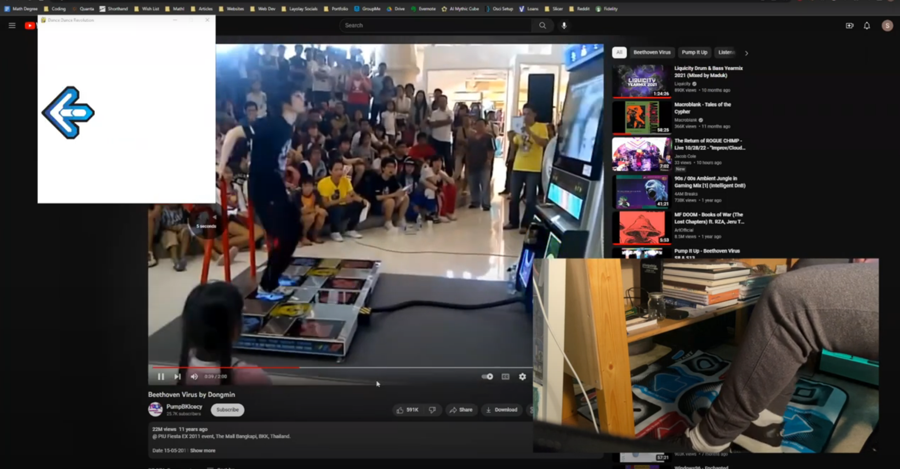

# Dance Pad
This is a repository that holds the code for all of the custom peripheral work I do with this dance pad I bought:

  

If you're interested in trying this yourself, I recommend either buying the same dance pad as me <a href='https://www.amazon.com/OSTENT-Non-Slip-Dancing-Blanket-Compatible-PC/dp/B00FJ2KTXC/ref=sr_1_7?keywords=dance+pads&qid=1669093405&sr=8-7'>here</a> or any other USB device you'd like to use and following along with the 
<a href="https://capsncrunch.github.io/articles/dance-pad-programming.html">article</a> I wrote on my blog.
